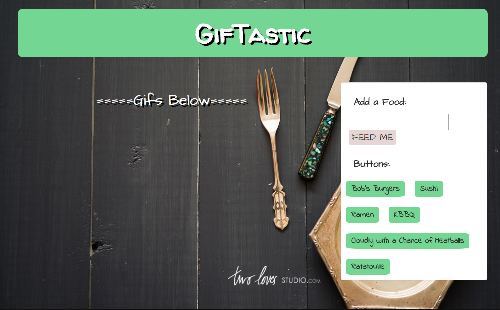
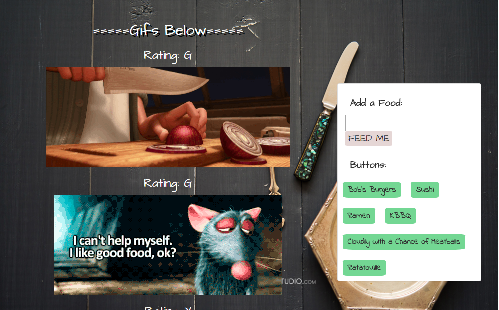

# GifTastic

### Overview

This web page populates with food gifs of users choice using GIPHY API.

   * Developers to use a key to access GIPHY API data. This is their[public API key](https://github.com/Giphy/GiphyAPI#public-beta-key).

### Instructions

1.  The web application should have given topics shown below the search bar.

2. Users can search for topics in the input box and add those topics to the bottomw.  

3. When the user clicks on a button, static, non-animated gif images from the GIPHY API will placed on the page. 

4. When the user clicks one of the still GIPHY images, the gif should animate. If the user clicks the gif again, it should stop playing.

5. Under every gif, its rating (PG, G, so on) is displayed. 

### **[Demo](https://munmuney.github.io/GifTastic/)**